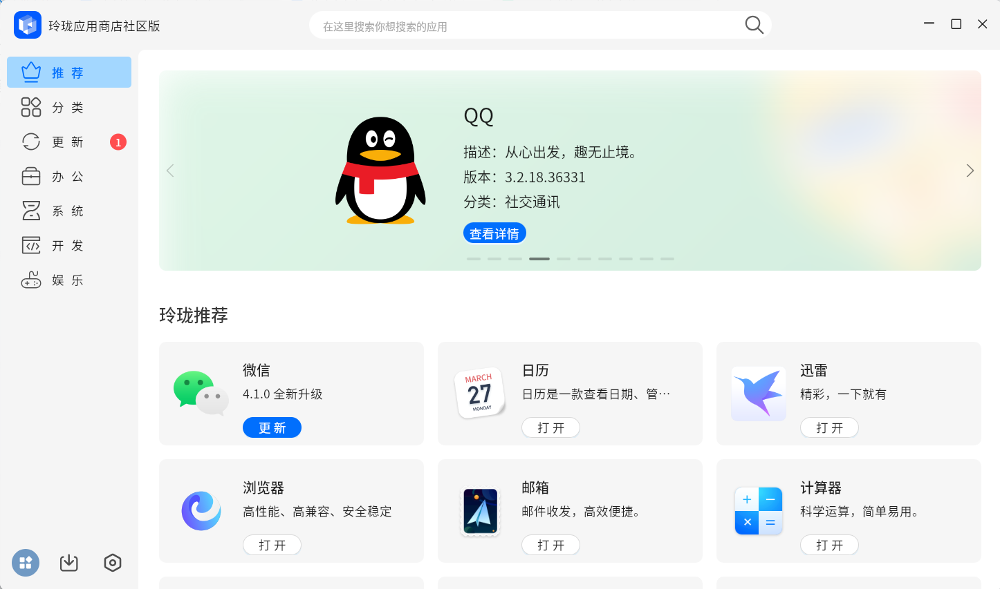
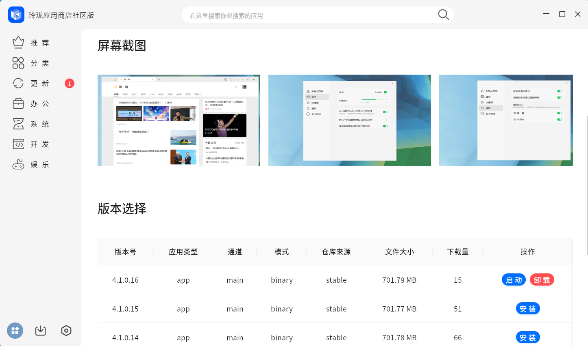
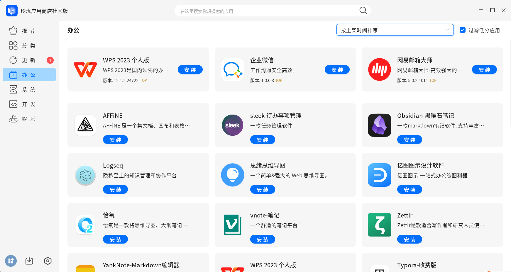
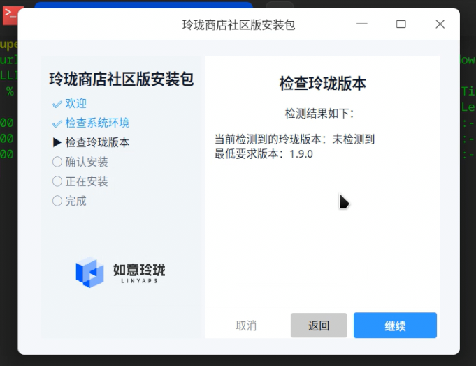
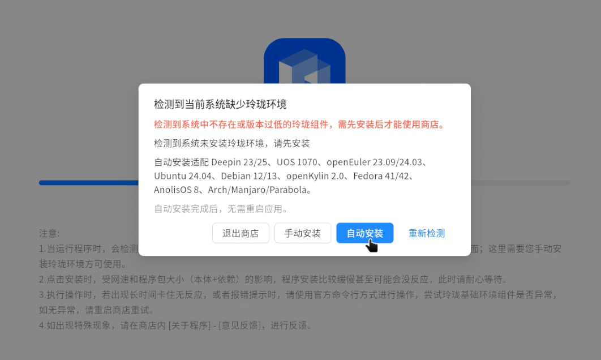

# 玲珑应用商店社区版

玲珑应用商店社区版是一个面向 Linux 的桌面客户端，用于浏览、搜索、安装、卸载、升级和启动玲珑应用。项目基于 `Tauri 2 + React 18 + TypeScript + Rust` 构建，前端负责界面与交互，Rust 侧负责本地桥接与 `ll-cli` 调用。

2.x 系列延续了社区版“轻量、本地优先、围绕玲珑生态”的方向，并将桌面容器迁移到 Tauri。 

Deepin 社区：<https://bbs.deepin.org.cn/post/295772>。

历史版本更新记录已迁移到 [CHANGELOG.md](./CHANGELOG.md)。

## 核心功能

- 应用浏览：提供推荐页、分类页、搜索结果页与应用详情页
- 应用生命周期管理：支持安装、卸载、更新、启动，并提供统一的安装队列与进度反馈
- 我的应用：集中查看已安装应用，并从应用卡片直接执行常用操作
- 玲珑进程管理：查看当前运行中的玲珑应用进程，支持停止进程与复制进入容器命令
- 环境检测：启动阶段检测 `ll-cli` 与玲珑运行环境状态
- 环境安装引导：在缺少玲珑环境时支持自动安装流程
- 系统清理：支持清理废弃的基础服务与运行时
- 反馈与诊断：支持意见反馈、日志上传与版本信息查看

## 技术架构

- 前端：React 18、TypeScript、Vite、Ant Design、Zustand、Alova
- 桌面容器：Tauri 2
- 本地桥接：Rust 服务层统一封装 `ll-cli`、环境检测、进程管理、安装状态事件
- 远程能力：应用元数据、推荐内容、反馈上报等通过 HTTP 接口补充

## 界面截图


### 桌面界面







### 安装器与环境支持






## 安装

如果你只想使用软件，不需要从源码运行，优先参考安装文档：

- 安装说明：[docs/how-to-install.md](./docs/how-to-install.md)
- 发布页：
  - GitHub: <https://github.com/SXFreell/linglong-store/releases/>
  - Gitee: <https://gitee.com/Shirosu/linglong-store/releases/>

对于已经安装玲珑环境的系统，也可以按文档中的方式直接通过 `ll-cli` 安装社区版应用包。

## 本地开发

### 环境要求

- Linux
- Node.js + `pnpm`
- Rust 工具链
- Tauri 2 开发依赖
- 本机可用的 `ll-cli`，用于联调安装、卸载、运行等真实流程

### 常用命令

```bash
pnpm install
pnpm dev
pnpm lint
pnpm build
```

可选环境脚本：

```bash
pnpm dev:test
pnpm dev:pro
pnpm build:test
pnpm build:pro
```

开发说明：

- 默认开发入口是 `pnpm dev`，它会启动 Tauri 与 Vite 联调环境
- Vite 固定端口为 `1420`
- Rust 侧改动后，通常需要完整重启 Tauri 开发进程
- 当前项目对 TypeScript 开启了严格模式，并要求通过 ESLint 检查

## 目录概览

```text
src/                    React 前端源码
src/apis/               HTTP 接口与 Tauri invoke 封装
src/components/         通用组件
src/hooks/              业务 hooks
src/layout/             桌面布局、标题栏、侧边栏、启动页
src/pages/              推荐、分类、详情、更新、我的应用、设置等页面
src/stores/             Zustand 状态管理
src-tauri/              Tauri/Rust 后端
docs/                   安装说明与专题文档
```

## 贡献指南

欢迎提交 Issue 和 Pull Request。为了让改动更容易被接收，建议先遵循下面的约定：

1. 在开始较大的功能或重构前，先开 Issue 或 Discussion 说明背景、改动面和预期影响。
2. 提交代码前先阅读 [AGENTS.md](./AGENTS.md)，仓库内的架构约束、代码风格和协作约定以该文件为准。
3. Commit message 建议使用 Conventional Commits，例如 `feat(ui): improve app detail loading state`。

## 相关文档

- 安装说明：[docs/how-to-install.md](./docs/how-to-install.md)
- 历史更新记录：[CHANGELOG.md](./CHANGELOG.md)


## 许可证

本项目采用 MIT License 发布。
